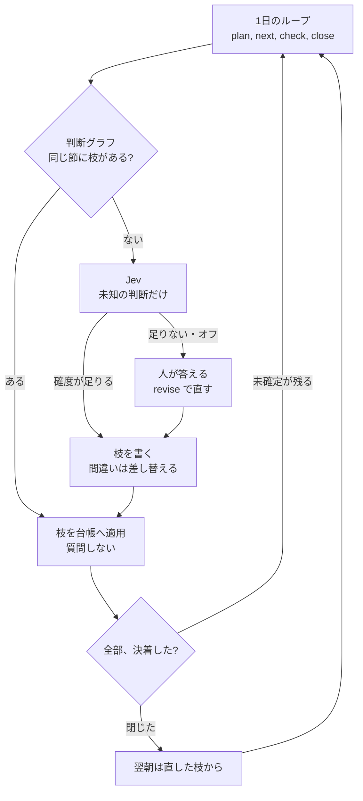

# dayloop

1日のタスクをループで回し、その判断をグラフで直し、未知の節だけ Jev に聞く。



朝は、今日やることを決める。日中は、次に手をつける1件を出す。昼は、まだ始めていないものを確認する。夕方は、残っているタスクを1件ずつ「終わった」「終わらなかった」「明日に回す」「やめる」のどれかにする。1件でも決まっていないと、その日は終わったことにできない。前日が終わっていないときは、翌朝は今日の予定より先に、その残りから始める。

一度答えたことは、その場で消さない。タスクの名前、どんな状況か、誰から来たかを覚えておき、選んだ結論と理由をセットで残す。次に同じものが来たら、名前、状況、相手の順に過去の答えを探す。見つかれば、もう聞かずにその結論を記録する。答えを変えるときは `revise` を使う。古い答えは履歴として残り、いま使うのは新しい方だけである。直した直後から、次の日はその新しい答えで進む。

過去の答えが無いものだけを Jev に聞く。今までの答えをまとめて渡すことはしない。確度 0.5 以上の答えは、下限を空にしていても覚えて、次の日からその件は質問しない。確度がそれより低いとき、人の確認が必要なとき、呼び出せないときは、人が選ぶ。その選択も次からの答えになる。まだ片付いていないタスクがある日を、勝手に終わったことにはしない。Jev は最初からオンだが、接続先とキーが無いあいだは人に残る。

https://github.com/awano27/dayloop

| ループ | コマンド | グラフと Jev |
|---|---|---|
| 朝 | `dayloop plan` | 既知の枝で候補と予定を進め、未知だけ聞く |
| 日中 | `dayloop next` | 並びの先頭を1件出す |
| 昼 | `dayloop check` | 未着手を、枝があれば質問せず進める |
| 夕 | `dayloop close` | 残件を決着させる。枝が無ければ Jev、足りなければ人 |
| 直し | `dayloop revise` | 選んだ手を新しい枝にする |
| 金曜夕 | `dayloop retro` | 週の完了率と、持ち越しが多いタスク |

3回持ち越したタスクは、分割・取り下げ・期限変更まで止まる。その答えも枝になる。

辿り方は [docs/analysis/05-decision-graph.md](docs/analysis/05-decision-graph.md)。Jev の確度は [docs/jev-eval.md](docs/jev-eval.md)。コマンドの残りと設定は [docs/guide.md](docs/guide.md)。

## 利用開始

Windows 10 / 11 で、このリポジトリをビルドする。管理者権限は要らない。台帳は `%LOCALAPPDATA%\dayloop` にできる。

```powershell
cargo build --release
.\target\release\dayloop.exe config init
.\target\release\dayloop.exe doctor
.\target\release\dayloop.exe where
```

`config init` は設定ファイルを作る。`doctor` は、Jev の鍵や画面の読み取りが無ければ、その1行を出す。無くても1日のループは動く。SmartScreen が出たら「詳細情報 → 実行」。

最初の1件を入れて、朝、日中、昼、夕の順に回す。

```powershell
.\target\release\dayloop.exe add "仕様書をレビューする" --due 2026-09-25 --estimate 30
.\target\release\dayloop.exe plan
.\target\release\dayloop.exe next
.\target\release\dayloop.exe check
.\target\release\dayloop.exe close
.\target\release\dayloop.exe today
```

`plan` の最後に「この内容で確定しますか」と出る。`close` は、残ったタスクが完了、未完了、持ち越し、取り下げのどれかになるまで、その日を閉じない。

Jev を使うときは、鍵を環境変数に置く。台帳には書かない。

```powershell
$env:DAYLOOP_JEV_API_KEY = "typesafe の鍵"
```

今開いている Outlook か Teams の文章は `.\target\release\dayloop.exe capture` で1回読む。作業の枝は `.\target\release\dayloop.exe steps` で見る。残りのコマンドは [docs/guide.md](docs/guide.md)。

## 動く範囲

| | |
|---|---|
| OS | Windows 10 / 11。管理者権限は不要 |
| Outlook | クラシック版があるときだけメールと予定を読む。無くてもループは動く |
| 外に出るもの | Jev を使うときだけ TypeSafe に聞く。鍵は環境変数に置き、台帳には書かない |
| Outlook への書き込み | しない。本文とメールアドレスは既定で読まない |

判断の記録は [docs/decisions.md](docs/decisions.md)。MCP のつなぎ方は [docs/mcp-clients.md](docs/mcp-clients.md)。

## この先

今あるのは、1日のループ、判断グラフ、未知の節への Jev、MCP、常駐、Outlook の読み取りまで。

予定は [docs/plans/2026-09-22-roadmap.md](docs/plans/2026-09-22-roadmap.md)。
