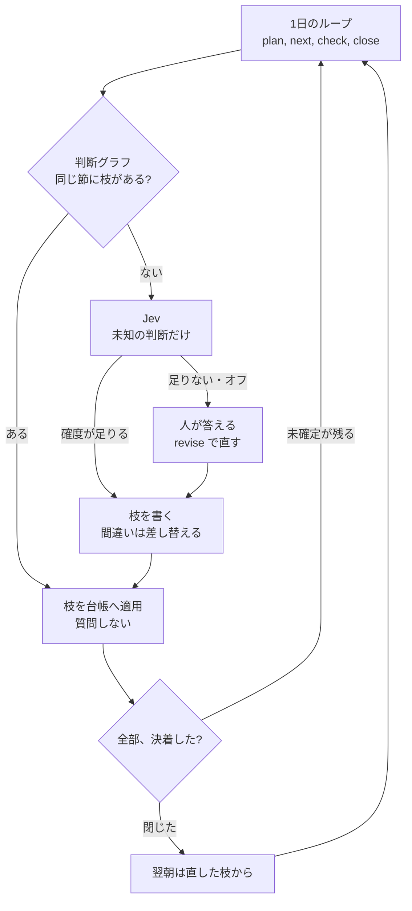

# dayloop

1日のタスクをループで回し、その判断をグラフで直し、未知の節だけ Jev に聞く。



朝に予定を決め、日中は次の1件を出し、昼に未着手を確認し、夕に1件ずつ決着させる。未確定が残る日は台帳が閉じない。前日が開いたままなら、翌朝のループはそこから始まる。

その場の回答では終わらせない。件名、状況、送信者を節にし、選んだ手と理由を枝にする。次に同じ節が来たら、件名から状況、送信者の順に辿り、当たった枝をそのまま台帳へ入れる。質問は出さない。直しは `revise` で行う。古い枝は残し、今の答えだけを active にする。直したその回から、次のループは新しい枝を使う。

枝が無い節だけを Jev に渡す。グラフ全体は渡さない。確度が足りる答えは枝になり、翌日からその節は質問しない。足りない答え、要確認、Jev がオフのときは人が選び、その回答が枝になる。開いたタスクが残る日を閉じる権限は、グラフにも Jev にも渡さない。Jev は既定でオフなので、ループとグラフだけでも回る。

A daily task loop. Decisions are stored and corrected as a graph. Jev judges only the nodes that have no edge. The ledger still closes the day.

https://github.com/awano27/dayloop

| ループ | コマンド | グラフと Jev |
|---|---|---|
| 朝 | `dayloop plan` | 既知の枝で候補と予定を進め、未知だけ聞く |
| 日中 | `dayloop next` | 並びの先頭を1件出す |
| 昼 | `dayloop check` | 未着手を、枝があれば質問せず進める |
| 夕 | `dayloop close` | 残件を決着させる。枝が無ければ Jev、足りなければ人 |
| 直し | `dayloop revise` | 選んだ手を新しい枝にする |
| 金曜夕 | `dayloop retro` | 週の完了率と、持ち越しが多いタスク |

3回持ち越したタスクは、分割・取り下げ・期限変更まで止まる。その答えも枝になる。

辿り方は [docs/analysis/05-decision-graph.md](docs/analysis/05-decision-graph.md)。Jev の確度は [docs/jev-eval.md](docs/jev-eval.md)。コマンドの残りと設定は [docs/guide.md](docs/guide.md)。

## 試す

```bash
cargo build --release
```

`target/release/dayloop.exe` を好きなフォルダに置く。SmartScreen は「詳細情報 → 実行」。昇格は不要。書き込みは `%LOCALAPPDATA%\dayloop` だけ。配布用の zip はまだ無い。

## 動く範囲

| | |
|---|---|
| OS | Windows 10 / 11。管理者権限は不要 |
| Outlook | クラシック版があるときだけメールと予定を読む。無くてもループは動く |
| 外に出るもの | ない。パスワードもトークンも持たない |
| Outlook への書き込み | しない。本文とメールアドレスは既定で読まない |

判断の記録は [docs/decisions.md](docs/decisions.md)。MCP のつなぎ方は [docs/mcp-clients.md](docs/mcp-clients.md)。

## この先

今あるのは、1日のループ、判断グラフ、未知の節への Jev、MCP、常駐、Outlook の読み取りまで。

予定は [docs/plans/2026-09-22-roadmap.md](docs/plans/2026-09-22-roadmap.md)。
