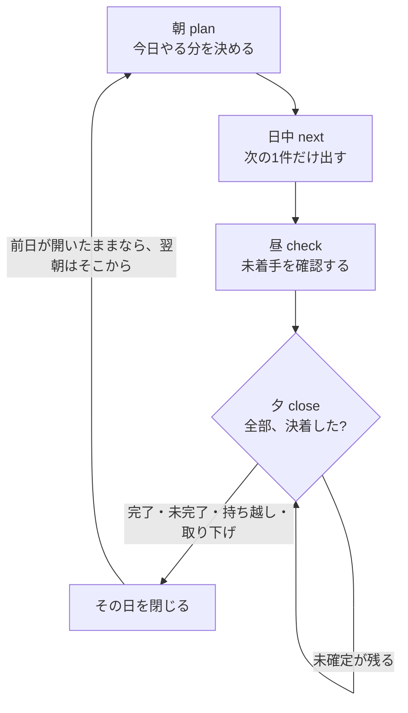

# dayloop



未確定が残る日は、台帳が閉じない。判断するのは LLM ではなく、このループ。

A local Windows CLI. The ledger closes the day only when every task is decided.

https://github.com/awano27/dayloop

| いつ | コマンド | 画面で起きること |
|---|---|---|
| 朝 | `dayloop plan` | 前日の残り、候補、今日の予定を確定する |
| 日中 | `dayloop next` | 並びの先頭を1件出す |
| 昼 | `dayloop check` | 未着手を、やるか持ち越すか聞く |
| 夕 | `dayloop close` | 1件ずつ完了・未完了・持ち越し・取り下げ。残ると閉じない |
| 金曜夕 | `dayloop retro` | 週の完了率と、持ち越しが多いタスク |

3回持ち越したタスクは、分割・取り下げ・期限変更まで止まる。

コマンドの残り、終了コード、設定は [docs/guide.md](docs/guide.md)。

## 試す

```bash
cargo build --release
```

`target/release/dayloop.exe` を好きなフォルダに置く。SmartScreen は「詳細情報 → 実行」。昇格は不要。書き込みは `%LOCALAPPDATA%\dayloop` だけ。配布用の zip はまだ無い。

## 動く範囲

| | |
|---|---|
| OS | Windows 10 / 11。管理者権限は不要 |
| Outlook | クラシック版があるときだけメールと予定を読む。無くても上のループは動く |
| 外に出るもの | ない。パスワードもトークンも持たない |
| Outlook への書き込み | しない。本文とメールアドレスは既定で読まない |

判断の記録は [docs/decisions.md](docs/decisions.md)。MCP のつなぎ方は [docs/mcp-clients.md](docs/mcp-clients.md)。

## この先

今あるのは CLI、MCP、常駐、Outlook の読み取りまで。人が答えたことは次から質問しない。同じ状況の枝が無いときだけ Jev が初回の判断をする。開いたタスクが残る日を閉じる権限は台帳のまま。

予定は [docs/plans/2026-09-22-roadmap.md](docs/plans/2026-09-22-roadmap.md)。判断の残し方は [docs/analysis/05-decision-graph.md](docs/analysis/05-decision-graph.md)。
